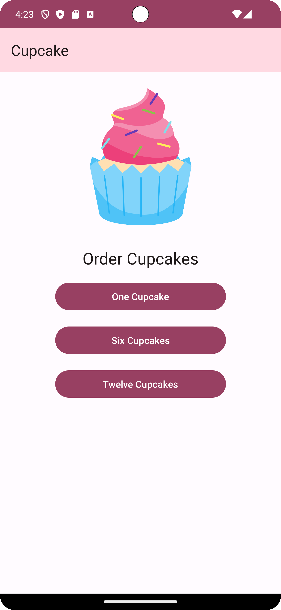
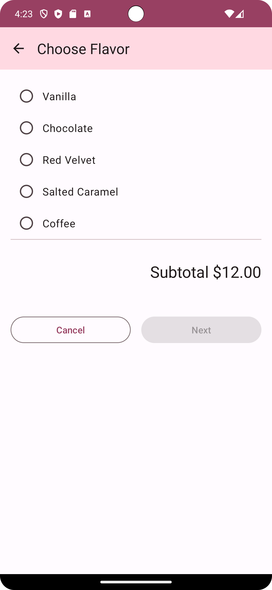
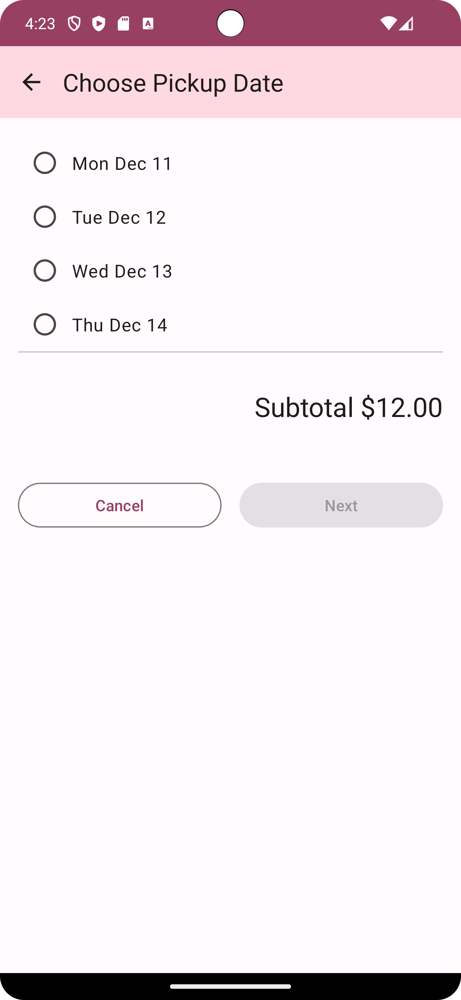
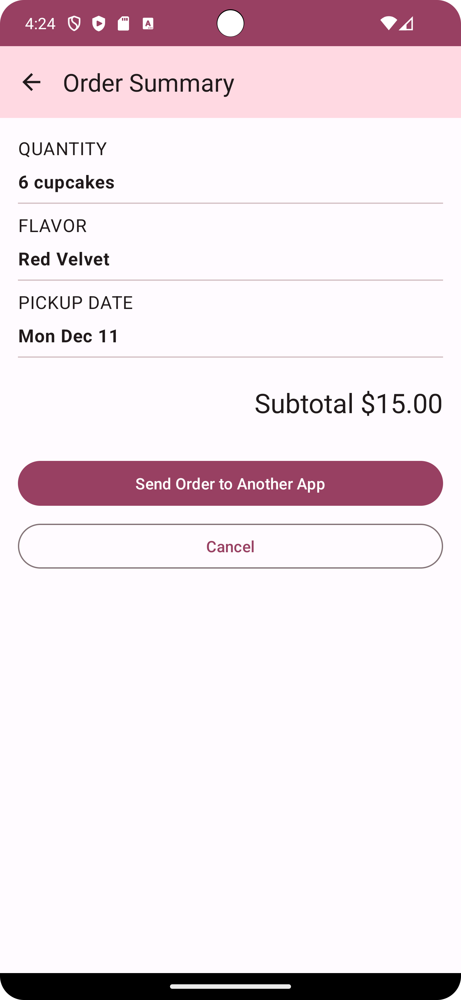
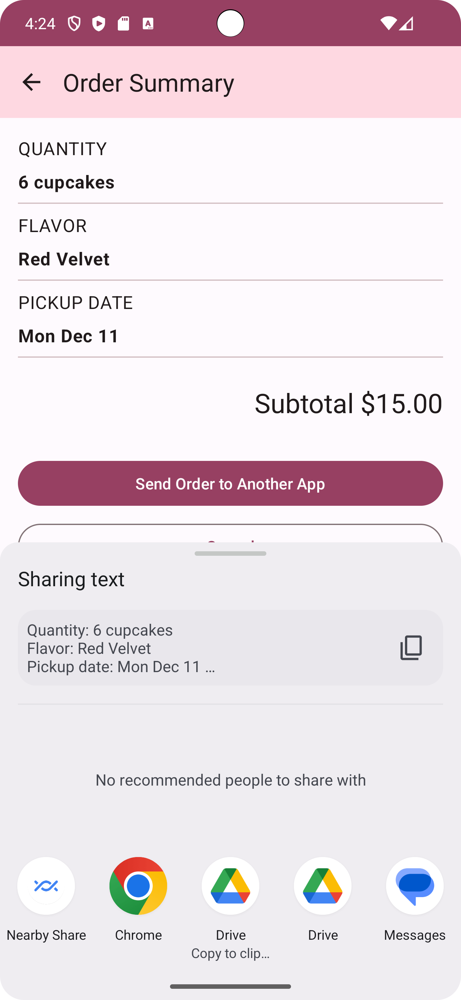

Cupcake app
=================================

This app contains an order flow for cupcakes with options for quantity, flavor, and pickup date.
The order details get displayed on an order summary screen and can be shared to another app to
send the order.

It's developed using Jetpack Compose components like ```Column```, ```Button```, ```Text```, ```Image```, and ```Modifier```.

<p align="center">
  
  
  
  
  
</p>


Getting Started
---------------
1. Install Android Studio, if you don't already have it.
2. Download the sample.
3. Import the sample into Android Studio.
4. Build and run the sample.
